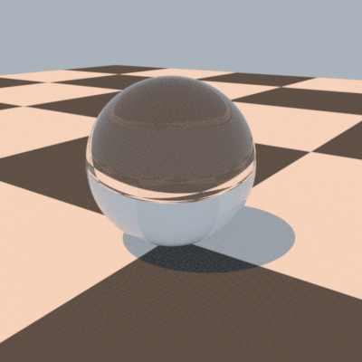

# PBRTv4_Tests
## Introduction
A collection of tests that i am doing on the awesome pbrt v4 library. I expect the reader to be comfortable in compiling and running the pbrt v4 from source. I am also assuming that you have enabled GPU and interactive mode for speed of output. Otherwise you will have to wait a few seconds to see the output.

## SimpleScene
The first test i did is to render a simple pbrt scene file but by using my own C++ code in Windows in VisualStudio 2022 in Win32 console application. That is I am calling the pbrt library functions from the libpbrt.lib file that is generated from the pbrt library. 

The source code is shared in SimpleScene folder. First, setup two environment variables: PBRT_ROOT which points to the root folder of PBRTv4 and PBRT_BUILD_ROOT which points to the root folder of the PBRTv4 build folder where your VisualStudio2022 solution of PBRTv4 resides. Once you have the two environment variables setup, please log out and then log in again to ensure that the environment variables are updated. Then, open the VisualStudio2022 solution and press the build button. If all goes well, you should see a glass sphere on a checkered plane rendered.

## Output

